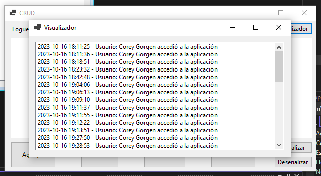
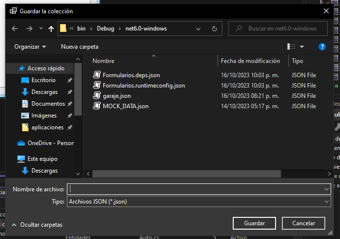
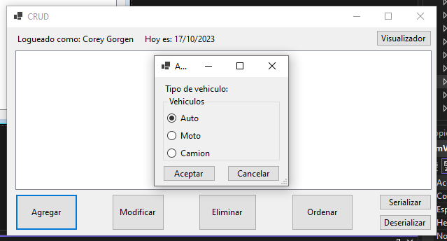
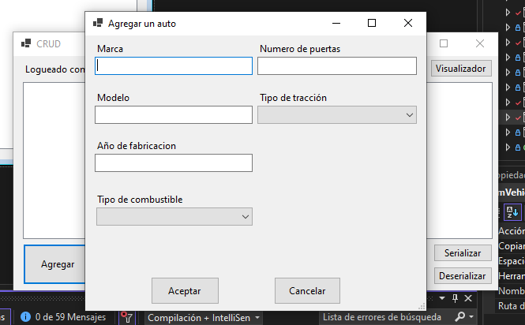
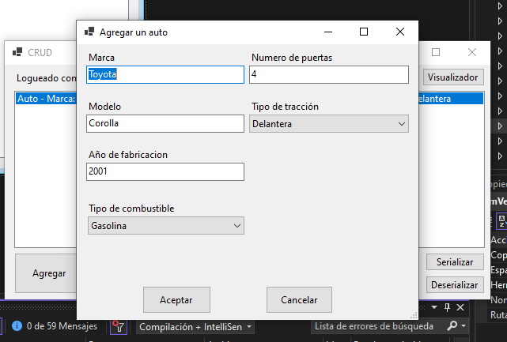
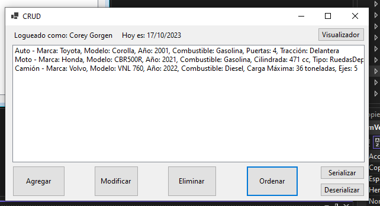
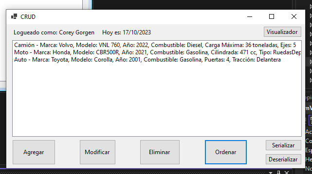
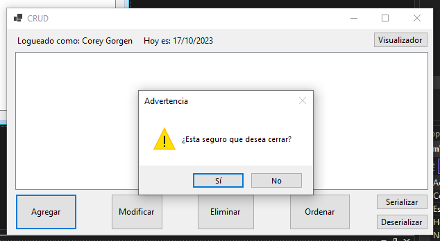

# CRUD - Vehiculos

## Sobre Mí

Buenas, soy Gerardo Toranzo, el desarrollador de esta aplicación. Estoy en el segundo cuatrimestre de la carrera Tecnicatura Superior en Programacion de la UTN, esta es mi tercera aplicacion oficial, hice un juego con C# en el motor Unity, y despues hice un buscaminas con Python en el primer cuatrimestre de la carrera.

## Resumen

Esta aplicacion, es una herramienta de gestión de vehículos en un garaje. Permite a los usuarios realizar operaciones CRUD (Crear, Leer, Actualizar y Eliminar) en una colección de vehículos. La aplicación es fácil de usar y proporciona una interfaz gráfica para interactuar con los datos de vehículos almacenados en un garaje virtual.

## Diagrama de Clases

## Cómo usar

1. Inicio de Sesión: Al abrir la aplicación, se muestra una ventana de inicio de sesión. Verificamos tus credenciales en un archivo JSON de usuarios. Si son correctas, se abre el formulario principal.

2. Formulario Principal: Aquí encontrarás botones, una lista de vehiculos, y etiquetas que muestran tu nombre de usuario y la fecha actual. Puedes realizar las siguientes acciones:

    **Visualizador**: Consulta tus registros de acceso.
    
    
    
    **Serialización**: Elige cómo guardar.
    
    
    
    **Deserializar**: Elige como cargar tus datos.
    
    
    
    **Agregar/Modificar/Eliminar**: Administra tu colección de vehículos.
    
    
    
    
    
    **Modificar**:
    
    
    
    **Ordenar**: Organiza tus vehículos según tus preferencias.
    
    
    
    

3. Salida Segura: Antes de salir, confirmaremos si deseas cerrar la aplicación.
   